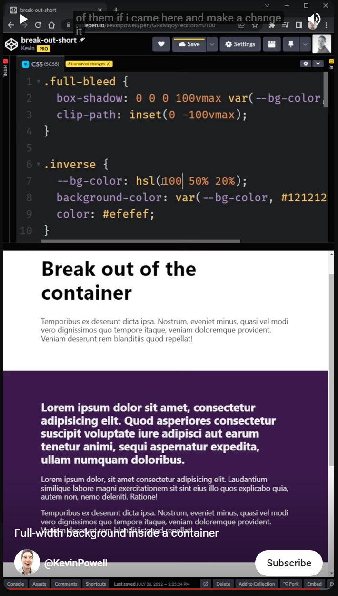

Great for sections whose background color should extend past the content width restriction to the edge.
Won't work when the content itself needs to extend past the max-width. 

The .full-bleed class has box shadow that extends the background color to the maximum vw and vh, and the clip path which clips it back down to just the vw so that it only extend to the height of the container itself. 
The bg-color variable makes it to where if you want to change th background color of the box itself, you don't have to update the background color of the box shadow too. 